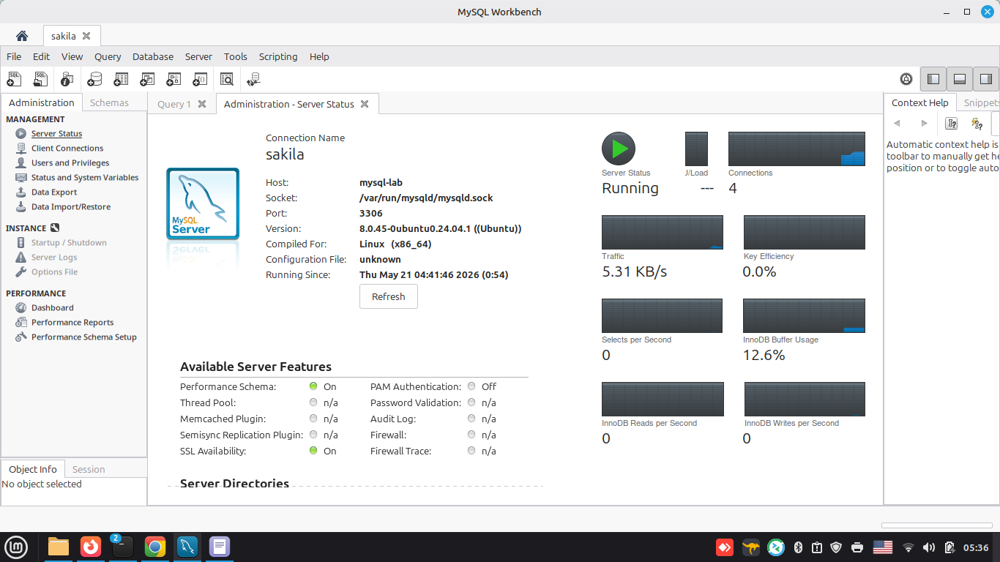

## 👨‍🎓 📖 🏫

# Домашнее задание к занятию  «Расширенные возможности SQL»

### Студент: **Герасин Дмитрий Сергеевич**

### Модуль: Реляционные базы данных и администрирование баз данных

#### Операции с данными в SQL

##      HW-12-04

Дата: 21.05.2026г.

---
---

## Задание 1

Одним запросом получите информацию о магазине, в котором обслуживается более 300 покупателей, и выведите в результат следующую информацию:

фамилия и имя сотрудника из этого магазина;
город нахождения магазина;
количество пользователей, закреплённых в этом магазине.

---

### Решение

Подключаемся к базе проверяем статус сервера



вводим команду 

```sql
SELECT 
    s.store_id,
    st.first_name,
    st.last_name,
    c.city,
    customer_count.cnt
FROM store s
JOIN staff st ON s.manager_staff_id = st.staff_id
JOIN address a ON s.address_id = a.address_id
JOIN city c ON a.city_id = c.city_id
JOIN (
    SELECT store_id, COUNT(*) AS cnt
    FROM customer
    GROUP BY store_id
    HAVING COUNT(*) > 300
) customer_count ON s.store_id = customer_count.store_id;
```


---

## Задание 2

Получите количество фильмов, продолжительность которых больше средней продолжительности всех фильмов.

---

### Решение

По логике задания необходимо первым действием вычислить среднюю 
продолжительность всех фильмов, затем сделать запрос на количество фильмов
удовлетворяющих условие. В итоге

```sql

SELECT COUNT(*) AS films_longer_than_avg
FROM film
WHERE length > (SELECT AVG(length) FROM film);

```


--- 

## Задание 3

Получите информацию, за какой месяц была получена наибольшая сумма платежей, и добавьте информацию по количеству аренд за этот месяц.

---

### Решение


---

## Задание 4*

Посчитайте количество продаж, выполненных каждым продавцом. Добавьте вычисляемую колонку «Премия». Если количество продаж превышает 8000, то значение в колонке будет «Да», иначе должно быть значение «Нет».

---

### Решение


---

## Задание 5*

Найдите фильмы, которые ни разу не брали в аренду.

---

### Решение


---
---

21.05.2026
---
---
---

Все тоже в облаке , в разработке  (нет интернета нормального)


